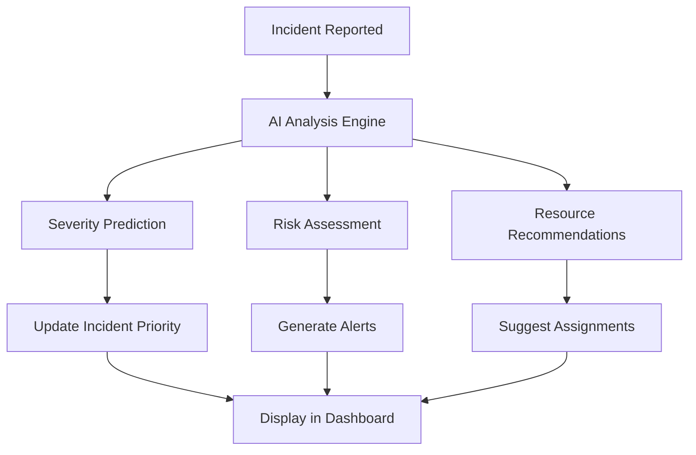

# AI Features

## Overview
The AI Features enhance the disaster response system by providing intelligent insights and recommendations for incident management. These features include AI-powered incident analysis, risk assessment, and resource allocation suggestions.

## Key Components
- **Incident Analysis**: AI analyzes incident data to provide severity predictions and response recommendations
- **Risk Assessment**: Evaluates potential risks based on incident patterns and historical data
- **Resource Allocation**: Suggests optimal volunteer assignments and resource distribution
- **Predictive Insights**: Provides forecasts for incident trends and response effectiveness

## Implementation Diagram



## How It's Implemented

### Backend Implementation
- **AI Metadata in Incident Model**: Added `aiInsights` field to store AI-generated data
- **AI Processing Route**: `/api/incidents/:id/ai-analyze` endpoint for triggering analysis
- **AI Helper Functions**: Utility functions for risk calculation and recommendation generation

### Frontend Implementation
- **AI Insight Panel**: New component displaying AI recommendations in dashboards
- **AI Preview in Forms**: Shows AI suggestions during incident creation
- **Real-time AI Updates**: Socket.IO integration for live AI insights

### Code Structure
```
Backend/
├── models/Incident.js (aiInsights field)
├── routes/incidents.js (AI analysis endpoints)
└── utils/ai.js (AI processing logic)

Frontend/
├── components/Dashboard.js (AI insight panel)
├── components/UserDashboard.js (AI preview)
└── utils/ai.js (Frontend AI utilities)
```

## Usage
1. Create an incident with description
2. AI automatically analyzes and provides insights
3. View recommendations in dashboard panels
4. Use AI suggestions for resource allocation</content>
<parameter name="filePath">D:\Rahat---Disaster-ManageMent-System\NewFeatures\AI_Features.md