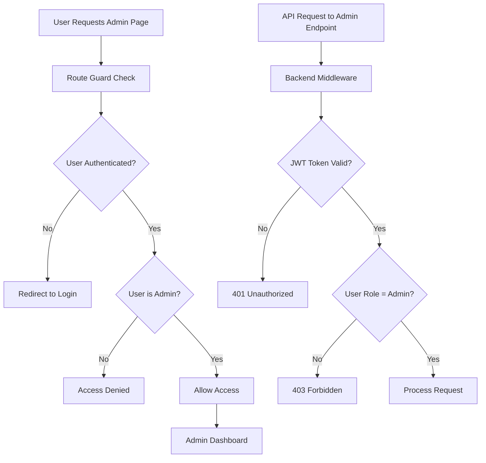

# Admin-Only Routing

## Overview
The Admin-Only Routing feature implements role-based access control to restrict admin functionality to authorized users only. This ensures system security and prevents unauthorized access to administrative features.

## Key Components
- **Role Verification**: Checks user role before allowing admin access
- **Protected Routes**: Route guards for admin-only pages
- **Access Control**: Middleware for backend admin endpoints
- **Permission Levels**: Different access levels for users, volunteers, admins

## Implementation Diagram



## How It's Implemented

### Backend Implementation
- **JWT Role Verification**: Middleware checks user role from token
- **Admin-Only Routes**: Protected endpoints with role validation
- **CORS Restrictions**: Frontend origin restrictions for security
- **Audit Logging**: Logs admin access attempts

### Middleware Code
```javascript
// Admin-only middleware
const requireAdmin = (req, res, next) => {
  if (req.user && req.user.role === 'admin') {
    next();
  } else {
    res.status(403).json({ message: 'Admin access required' });
  }
};
```

### Frontend Implementation
- **ProtectedRoute Component**: Higher-order component for route protection
- **Role-Based Rendering**: Conditional UI based on user permissions
- **Redirect Logic**: Automatic redirects for unauthorized access
- **Loading States**: Proper loading indicators during auth checks

### Code Structure
```
Backend/
├── middleware/auth.js (Role verification)
├── routes/admin.js (Protected admin routes)
├── server.js (CORS configuration)
└── utils/auditLogger.js (Access logging)

Frontend/
├── components/ProtectedRoute.js (Route protection)
├── components/Admin.js (Admin-only UI)
├── utils/api.js (Role-aware API calls)
└── App.js (Protected routing)
```

## Usage
1. User attempts to access admin features
2. System verifies authentication and admin role
3. Authorized admins get access, others are redirected
4. All admin actions are logged for security</content>
<parameter name="filePath">D:\Rahat---Disaster-ManageMent-System\NewFeatures\Admin_Only_Routing.md