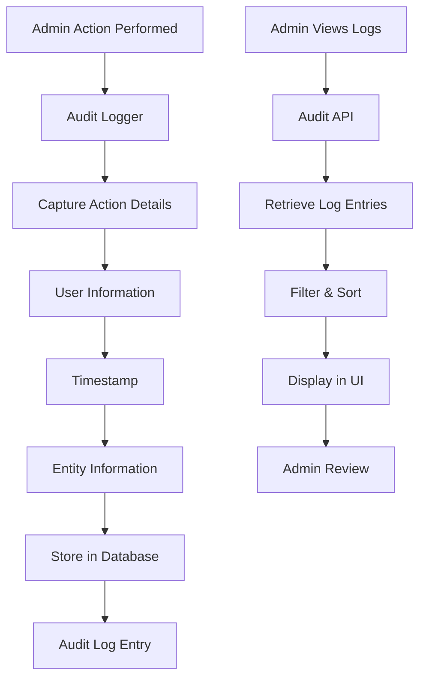

# Audit Logging

## Overview
The Audit Logging feature provides comprehensive tracking of administrative actions within the system. It records all admin activities for security, compliance, and system monitoring purposes.

## Key Components
- **Action Logging**: Records all admin operations (create, update, delete)
- **User Tracking**: Logs which admin performed each action
- **Timestamp Recording**: Precise timing of all activities
- **Audit Trail**: Complete history of system changes

## Implementation Diagram



## How It's Implemented

### Backend Implementation
- **AuditLog Model**: Database schema for storing audit entries
- **Audit Logger Utility**: Helper functions for logging actions
- **Middleware Integration**: Automatic logging for admin routes
- **Admin Audit Route**: API endpoint for retrieving audit logs

### Database Schema
```javascript
// AuditLog model
{
  userId: { type: mongoose.Schema.Types.ObjectId, ref: 'User' },
  userName: String,
  role: String,
  action: String, // 'incident_created', 'volunteer_assigned', etc.
  entityType: String, // 'incident', 'user', 'volunteer'
  entityId: String,
  details: Object, // Additional action details
  timestamp: { type: Date, default: Date.now },
  ipAddress: String
}
```

### Frontend Implementation
- **Audit Log Panel**: Admin dashboard section for viewing logs
- **Log Filtering**: Search and filter audit entries
- **Real-time Updates**: Live log updates via Socket.IO
- **Export Functionality**: Download audit logs for compliance

### Code Structure
```
Backend/
├── models/AuditLog.js (Audit schema)
├── utils/auditLogger.js (Logging utility)
├── routes/audit.js (Audit API)
├── routes/admin.js (Audit triggers)
└── routes/auth.js (Login/logout audit)

Frontend/
├── components/Admin.js (Audit log display)
├── utils/api.js (Audit API calls)
└── utils/format.js (Log formatting)
```

## Usage
1. Admin performs any action in the system
2. Action is automatically logged with details
3. Admin can view audit logs in dashboard
4. Logs provide complete activity history for security review</content>
<parameter name="filePath">D:\Rahat---Disaster-ManageMent-System\NewFeatures\Audit_Logging.md