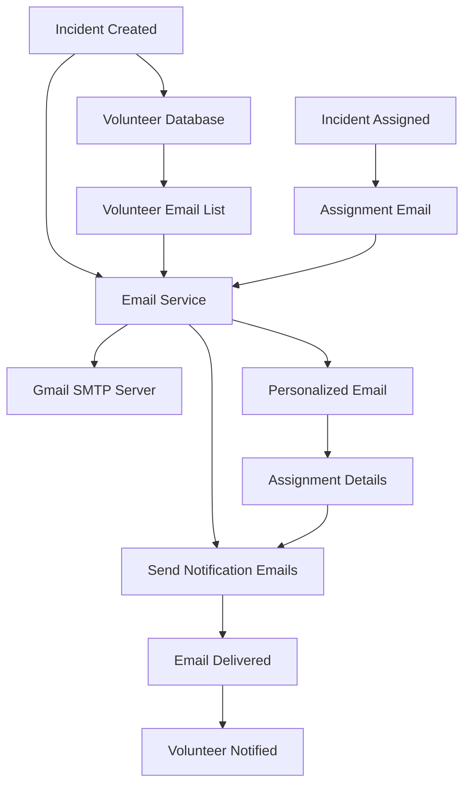

# Email Notification System

## Overview
The Email Notification System provides automated email communications for incident management, volunteer coordination, and system updates. It uses Gmail SMTP with App Password authentication for secure email delivery.

## Key Components
- **Incident Notifications**: Alerts volunteers when new incidents are reported
- **Assignment Notifications**: Emails sent when volunteers are assigned to incidents
- **Status Updates**: Notifications for incident status changes
- **System Alerts**: Administrative notifications for critical events

## Implementation Diagram



## How It's Implemented

### Backend Implementation
- **Nodemailer Integration**: SMTP client for email sending
- **Email Templates**: Predefined templates for different notification types
- **Gmail App Password**: Secure authentication using App Passwords
- **Email History**: Database storage of sent emails for tracking

### Configuration
```javascript
// Email configuration in .env
EMAIL_USER=your-gmail@gmail.com
EMAIL_APP_PASSWORD=your-app-password
EMAIL_FROM=Disaster Response System <noreply@system.com>
```

### Frontend Implementation
- **Email Settings**: Admin panel for configuring email preferences
- **Notification Preferences**: User settings for email subscriptions
- **Email Logs**: Admin view of sent notifications

### Code Structure
```
Backend/
├── utils/email.js (Email sending logic)
├── routes/incidents.js (Email triggers)
├── models/EmailLog.js (Email history)
└── middleware/auth.js (Email preferences)

Frontend/
├── components/Admin.js (Email settings)
├── components/Auth.js (Notification preferences)
└── utils/notifications.js (Email status)
```

## Usage
1. Configure Gmail App Password in environment variables
2. Set up email templates and preferences
3. System automatically sends emails on incident events
4. View email history in admin panel</content>
<parameter name="filePath">D:\Rahat---Disaster-ManageMent-System\NewFeatures\Email_Notification_System.md