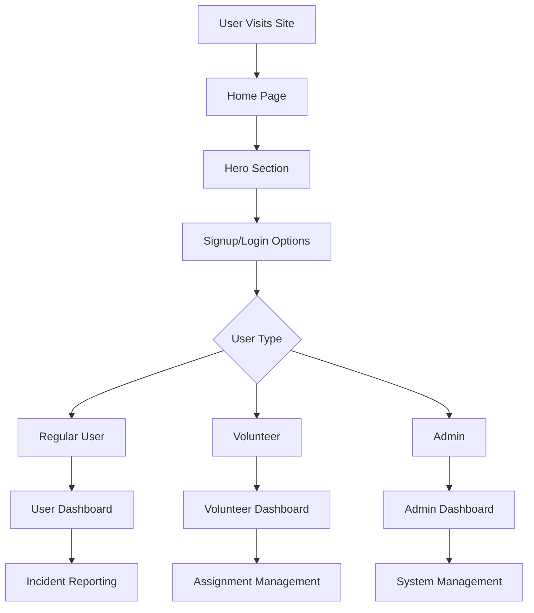

# Home Page

## Overview
The Home Page provides a professional landing page for the Disaster Response Management System. It serves as the entry point for users, featuring system introduction, signup/login options, and navigation to different user roles.

## Key Components
- **Hero Section**: System introduction and call-to-action
- **User Registration**: Signup form for new users
- **Role-Based Access**: Different dashboards for users, volunteers, admins
- **System Overview**: Brief description of platform capabilities

## Implementation Diagram



## How It's Implemented

### Frontend Implementation
- **Home Route**: New route at "/" for landing page
- **Responsive Design**: Mobile-friendly layout with Tailwind CSS
- **Navigation**: Links to signup, login, and different dashboards
- **Hero Content**: Professional messaging about disaster response

### Routing Structure
```javascript
// App.js routing
<Route path="/" element={<Home />} />
<Route path="/auth" element={<Auth />} />
<Route path="/dashboard" element={<ProtectedRoute><Dashboard /></ProtectedRoute>} />
<Route path="/admin" element={<ProtectedRoute adminOnly><Admin /></ProtectedRoute>} />
```

### Components
- **Home Component**: Landing page with hero section and navigation
- **Auth Integration**: Seamless transition to authentication
- **Role Detection**: Automatic routing based on user permissions

### Code Structure
```
Frontend/
├── components/Home.js (Landing page component)
├── components/Auth.js (Authentication forms)
├── components/Navigation.js (Site navigation)
├── App.js (Routing configuration)
└── index.css (Global styles)
```

## Usage
1. User visits the application URL
2. Views professional home page with system information
3. Chooses to sign up or log in
4. Gets redirected to appropriate dashboard based on role</content>
<parameter name="filePath">D:\Rahat---Disaster-ManageMent-System\NewFeatures\Home_Page.md