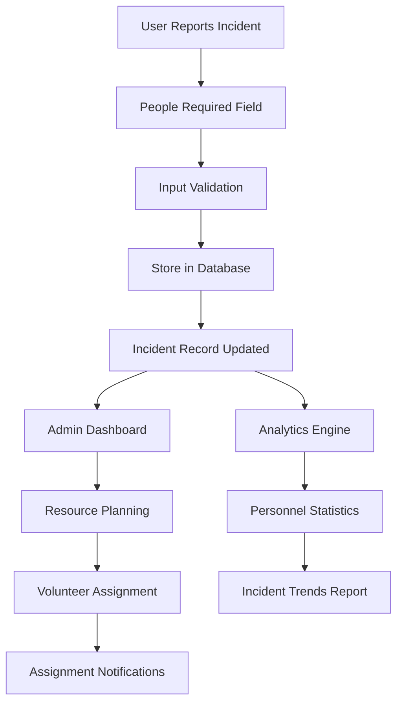

# People Required Reporting

## Overview
The People Required Reporting feature allows users to specify the number of people needed for incident response. This helps in resource planning and volunteer coordination for incidents of varying scale.

## Key Components
- **People Count Input**: Form field for specifying required personnel
- **Resource Planning**: Helps determine volunteer assignment needs
- **Incident Scaling**: Indicates incident severity through personnel requirements
- **Reporting Analytics**: Statistics on personnel requirements

## Implementation Diagram



## How It's Implemented

### Backend Implementation
- **Schema Extension**: Added `peopleRequired` field to Incident model
- **Validation**: Input validation for people count (1-1000 range)
- **API Endpoints**: Update endpoints for people required field
- **Analytics**: Backend calculations for resource planning

### Database Schema
```javascript
// Incident model addition
{
  peopleRequired: {
    type: Number,
    min: 1,
    max: 1000,
    default: 1
  }
}
```

### Frontend Implementation
- **Form Input**: Number input field in incident creation/editing forms
- **Validation**: Client-side validation with error messages
- **Display**: Show people required in incident lists and details
- **Analytics**: Charts showing personnel requirement trends

### Code Structure
```
Backend/
├── models/Incident.js (peopleRequired field)
├── routes/incidents.js (People count endpoints)
└── routes/admin.js (Analytics data)

Frontend/
├── components/UserDashboard.js (People input field)
├── components/Incidents.js (People display)
├── components/Admin.js (Analytics charts)
└── utils/format.js (Number formatting)
```

## Usage
1. User specifies number of people needed when reporting incident
2. System validates and stores the requirement
3. Admin uses data for resource planning
4. Analytics show trends in personnel needs</content>
<parameter name="filePath">D:\Rahat---Disaster-ManageMent-System\NewFeatures\People_Required_Reporting.md