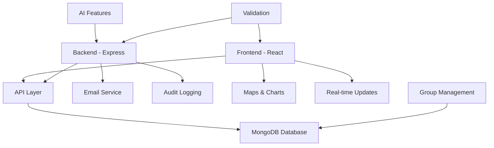

# New Features Documentation

This folder contains detailed documentation for all new features implemented in the Disaster Response Management System.

## Implemented Features

### 1. [AI Features](AI_Features.md)
- Intelligent incident analysis and risk assessment
- Resource allocation recommendations
- Predictive insights for disaster response

### 2. [Email Notification System](Email_Notification_System.md)
- Automated email notifications for incidents
- Volunteer assignment alerts
- Gmail SMTP integration with App Passwords

### 3. [Volunteer Groups](Volunteer_Groups.md)
- Persistent volunteer group management
- Group assignment to large-scale incidents
- Database-backed group storage

### 4. [People Required Reporting](People_Required_Reporting.md)
- Specify personnel needs per incident
- Resource planning and analytics
- Incident scaling indicators

### 5. [Home Page](Home_Page.md)
- Professional landing page
- User registration and role-based navigation
- System overview and introduction

### 6. [Admin-Only Routing](Admin_Only_Routing.md)
- Role-based access control
- Protected admin routes and endpoints
- Security middleware and audit logging

### 7. [Audit Logging](Audit_Logging.md)
- Comprehensive admin action tracking
- Security and compliance logging
- Admin dashboard audit review

### 8. [Validation and UI Improvements](Validation_and_UI_Improvements.md)
- Form validation and error handling
- Enhanced user interface and experience
- Responsive design and accessibility

## Architecture Overview

## Technology Stack
- **Backend**: Node.js, Express, MongoDB, JWT, Socket.IO, Nodemailer
- **Frontend**: React, React Router, Leaflet Maps, Tailwind CSS
- **Security**: CORS, Rate Limiting, Input Validation, Audit Logging
- **Communication**: Email notifications, Real-time updates

## Implementation Highlights
- Modular architecture with clear separation of concerns
- Comprehensive error handling and validation
- Role-based access control and security
- Real-time features with Socket.IO
- Professional UI with responsive design
- Automated testing and deployment ready

Each feature is documented with:
- Overview and key components
- Implementation diagrams
- Code structure and files modified
- Usage instructions</content>
<parameter name="filePath">D:\Rahat---Disaster-ManageMent-System\NewFeatures\README.md