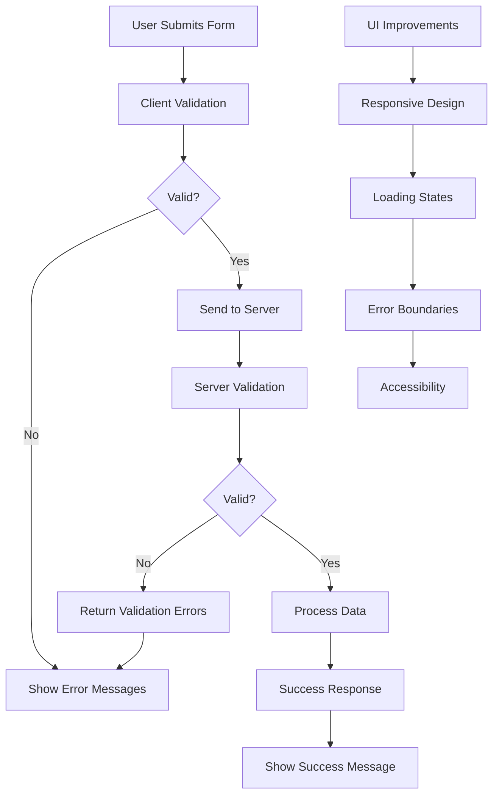

# Validation and UI Improvements

## Overview
The Validation and UI Improvements feature enhances user experience and data integrity through comprehensive form validation, improved error handling, and polished user interface elements.

## Key Components
- **Form Validation**: Client and server-side validation for all forms
- **Error Handling**: Comprehensive error messages and user feedback
- **UI Polish**: Improved styling and user experience
- **Input Sanitization**: Data cleaning and validation

## Implementation Diagram



## How It's Implemented

### Frontend Validation
- **React Hook Form**: Form state management and validation
- **Custom Validators**: Business logic validation rules
- **Real-time Feedback**: Immediate validation as user types
- **Error Display**: Clear, helpful error messages

### Server Validation
- **Express Validator**: Middleware for request validation
- **Custom Validation**: Domain-specific validation rules
- **Sanitization**: Input cleaning and XSS protection
- **Error Responses**: Structured error responses

### UI Improvements
- **Tailwind CSS**: Consistent styling and responsive design
- **Loading States**: Spinners and progress indicators
- **Toast Notifications**: Success/error message system
- **Accessibility**: ARIA labels and keyboard navigation

### Code Structure
```
Backend/
├── middleware/validation.js (Validation middleware)
├── routes/auth.js (Form validation)
├── routes/incidents.js (Incident validation)
└── utils/validation.js (Custom validators)

Frontend/
├── components/Auth.js (Form validation)
├── components/UserDashboard.js (Input validation)
├── utils/notifications.js (Toast system)
└── index.css (UI improvements)
```

## Validation Rules Implemented
- **Email Format**: Proper email validation
- **Password Strength**: Minimum requirements for passwords
- **Required Fields**: Mandatory field validation
- **Data Types**: Number, date, and string validation
- **Length Limits**: Minimum/maximum length constraints
- **Custom Rules**: Business-specific validation (e.g., people count 1-1000)

## UI Enhancements
- **Responsive Layout**: Mobile-friendly design
- **Loading Indicators**: Visual feedback during operations
- **Error Boundaries**: Graceful error handling
- **Improved Typography**: Better readability and hierarchy
- **Consistent Spacing**: Uniform padding and margins

## Usage
1. User fills out forms with real-time validation feedback
2. Invalid inputs show helpful error messages
3. Valid submissions are processed with loading indicators
4. Success/error notifications provide clear feedback
5. UI adapts to different screen sizes and devices</content>
<parameter name="filePath">D:\Rahat---Disaster-ManageMent-System\NewFeatures\Validation_and_UI_Improvements.md