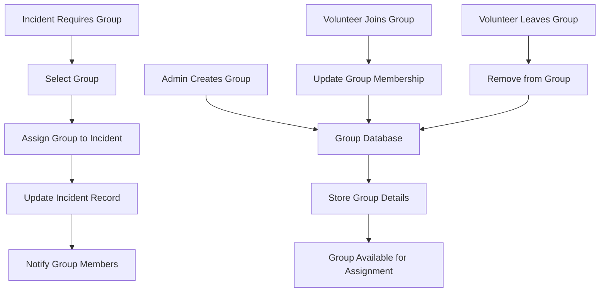

# Volunteer Groups

## Overview
The Volunteer Groups feature allows for organized management of volunteer teams for large-scale incidents. Groups can be created, assigned to incidents, and managed through persistent database storage.

## Key Components
- **Group Creation**: Admin can create and manage volunteer groups
- **Group Assignment**: Assign groups to specific incidents
- **Group Persistence**: Groups stored in database for reuse
- **Group Management**: Add/remove volunteers from groups

## Implementation Diagram



## How It's Implemented

### Backend Implementation
- **Group Model**: New `Group` schema with name, description, members
- **Group Routes**: CRUD operations for group management
- **Incident Integration**: Groups field in incident schema
- **Assignment Logic**: API endpoints for group assignment

### Database Schema
```javascript
// Group model
{
  name: String,
  description: String,
  members: [{ type: mongoose.Schema.Types.ObjectId, ref: 'User' }],
  createdBy: { type: mongoose.Schema.Types.ObjectId, ref: 'User' },
  createdAt: Date
}

// Incident model addition
{
  assignedGroups: [{ type: mongoose.Schema.Types.ObjectId, ref: 'Group' }]
}
```

### Frontend Implementation
- **Group Management Panel**: Admin interface for creating/managing groups
- **Group Assignment UI**: Dropdown selection in incident forms
- **Group Display**: Show assigned groups in incident details
- **Member Management**: Add/remove volunteers from groups

### Code Structure
```
Backend/
├── models/Group.js (Group schema)
├── routes/groups.js (Group CRUD)
├── routes/incidents.js (Group assignment)
└── routes/admin.js (Group management)

Frontend/
├── components/Admin.js (Group management UI)
├── components/Incidents.js (Group assignment)
├── components/Dashboard.js (Group display)
└── utils/api.js (Group API calls)
```

## Usage
1. Admin creates volunteer groups
2. Add volunteers to groups
3. Assign groups to large incidents
4. Groups persist for future use</content>
<parameter name="filePath">D:\Rahat---Disaster-ManageMent-System\NewFeatures\Volunteer_Groups.md