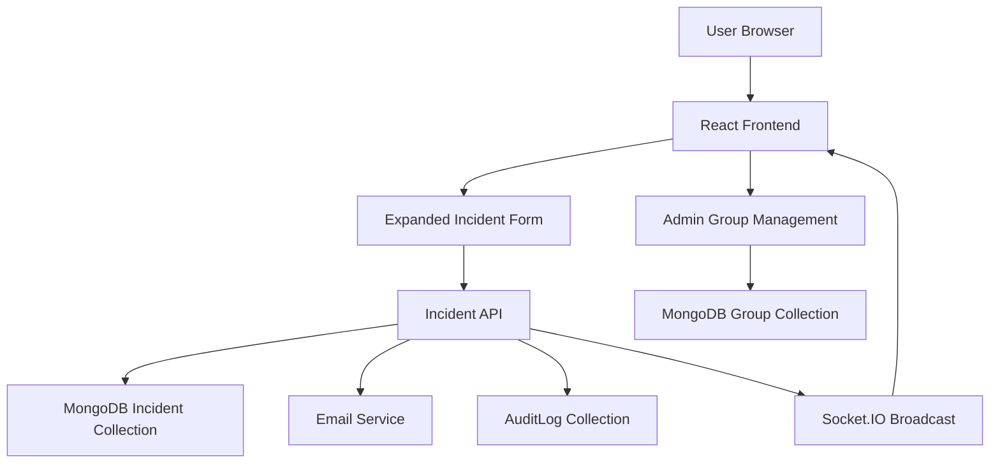
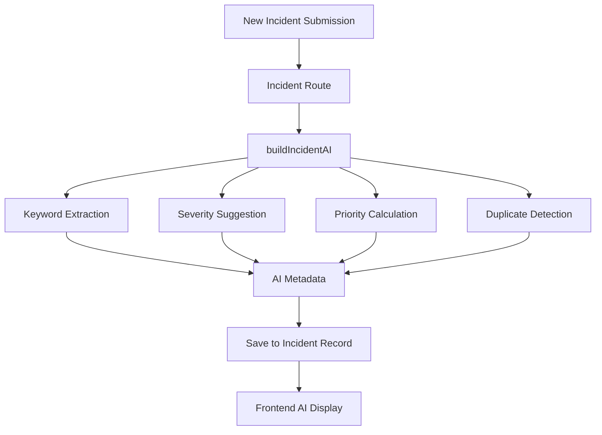

# Complete Detail

## 1. Old Features

### Purpose
The original app offered a disaster response workflow centered on user authentication, incident reporting, volunteer coordination, and admin review.

### Key Old Features
- User authentication and role-based routing (admin, volunteer, user)
- Incident submission with type, severity, description, and location
- Map-based incident visualization using Leaflet
- Volunteer dashboard and volunteer assignment flows
- Admin dashboard for incident verification and system management
- Basic incident CRUD endpoints and reporting
- Protected API routes with JWT auth

### Data Flow Diagram (DFD)
```mermaid
graph TD
    A[User Browser] --> B[React Frontend]
    B --> C[Auth API (/api/auth)]
    B --> D[Incident API (/api/incidents)]
    B --> E[Volunteer API (/api/volunteers)]
    C --> F[MongoDB Users]
    D --> G[MongoDB Incidents]
    E --> H[MongoDB Volunteers]
    B --> I[Leaflet Map]
    I --> G
```

### Data Flow
1. User logs in or registers via `/api/auth`
2. Frontend stores session and routes to dashboard
3. User reports an incident via `/api/incidents`
4. Incident is stored in MongoDB
5. Map component loads incidents and renders markers
6. Admin and volunteer dashboards consume incident, user, and volunteer data

---

## 2. Newly Added Features

### Purpose
New functionality extends the system with richer incident metadata, operational support, auditability, and automated notification behavior.

### Newly Added Features
- **Advanced incident fields**: contact info, affected people, property damage, urgency, weather, incident timestamp, resources needed, accessibility notes
- **People required reporting** for incident scaling
- **Volunteer groups** persisted in MongoDB and assignable to incidents
- **Admin-only routing** via `ProtectedRoute` and server-side role checking
- **Audit logging** of admin/user actions into `AuditLog` collection
- **Real-time updates** via Socket.IO events for incident create/update/delete
- **Email notification scaffolding** for incident reporting and volunteer notification
- **Improved UI/UX**: sectioned reporting form, modern card layout, validation, and notification feedback
- **Home page and landing experience** for better app entry

### Data Flow Diagram (DFD)


### Data Flow
1. User fills advanced incident form in `UserDashboard`
2. Backend validates and writes new fields into `Incident` model
3. `AuditLog` records incident creation and admin actions
4. Socket.IO broadcasts event to update connected clients
5. Admin can manage volunteer groups and review audit history
6. Email notifications are prepared when incidents are created

---

## 3. AI Feature

### Purpose
AI is implemented as a local heuristic engine to enhance new incident reports with summary, priority, duplicate detection, and type/severity hints.

### AI Process
- Input: incident description, type, severity, and location
- Processing:
  - tokenize description
  - extract keywords
  - infer incident type when unknown
  - suggest severity based on high-impact keywords
  - compute priority from severity
  - summarize description
  - compute duplicate similarity against recent incidents within 5km
- Output: AI metadata saved in incident record

### AI Model Location
- `Backend/utils/incidentAI.js`
- `Backend/routes/incidents.js` injects `buildIncidentAI(...)`
- `Backend/models/Incident.js` stores AI output in the `ai` field

### AI Output Fields
- `suggestedType`
- `suggestedSeverity`
- `priority`
- `keywords`
- `summary`
- `duplicateOf`
- `duplicateScore`
- `confidence`

### AI Flow Diagram


### AI Display Points
- `UserDashboard` preview panel
- incident card lists in `Admin.js`, `Incidents.js`, `Volunteers.js`
- stored in incident documents for future analysis

---

## 4. Non-working / Fix Required Features

### Known Issues and Risks
- **AI feature may appear broken for old incidents**: only incidents created after AI integration get `ai` metadata. Legacy records will not show AI output until re-created or migrated.
- **Email notification requires SMTP configuration**: Gmail App Password and `.env` values are needed; if missing, notifications will not send.
- **Frontend ESLint warnings**: there are several unused variables and missing React hook dependencies in admin/dashboard/incident components. These warnings should be cleaned.
- **`weatherConditions` schema mismatch**: current model stores weather as a string with an enum and also includes `description` in code comments. This makes it unclear whether the object or string is intended. The schema should be normalized.
- **Group roleScope dependency**: group routes and seed data require `roleScope`; any models or UI that omit it may fail.
- **Socket real-time UI may need explicit reconnect handling**: current app registers Socket.IO events, but client reconnection and error states should be hardened.
- **Validation mismatch**: form fields added in `UserDashboard` must map exactly to backend validation names; if names differ, incident creation may fail.
- **Indirect admin routing behavior**: admin routes are protected, but role mismatch displays generic redirect. Better user feedback is needed on unauthorized access.

### Recommended Fixes
1. Add a migration or re-save step to populate `ai` fields for legacy incidents.
2. Confirm `.env` email config and add error logging for SMTP failures.
3. Normalize `weatherConditions` in the incident model to either object schema with `type`+`description`, or a single enum string.
4. Clean frontend warnings by removing unused imports and adding missing hook dependencies.
5. Add clearer UI states when Socket.IO is disconnected or unable to load realtime updates.
6. Add explicit backend validation for all newly added incident fields, including contact info and `resourcesNeeded`.
7. Ensure `Group` creation and assignment UI includes `roleScope` on the frontend if groups are created dynamically.

---

## Appendix: Project Architecture Summary

- **Backend**: Express, MongoDB, JWT auth, Socket.IO, Nodemailer, express-validator
- **Frontend**: React, React Router, dynamic dashboard pages, Leaflet maps, form validation
- **Data Stores**: `User`, `Incident`, `Group`, `AuditLog`
- **APIs**: `/api/auth`, `/api/users`, `/api/incidents`, `/api/volunteers`, `/api/admin`, `/api/groups`, `/api/audit`
- **AI**: local heuristic text analysis only, no external API dependence

This document should be used as the complete analysis reference for current project design, recent enhancements, AI behavior, and outstanding fixes.
