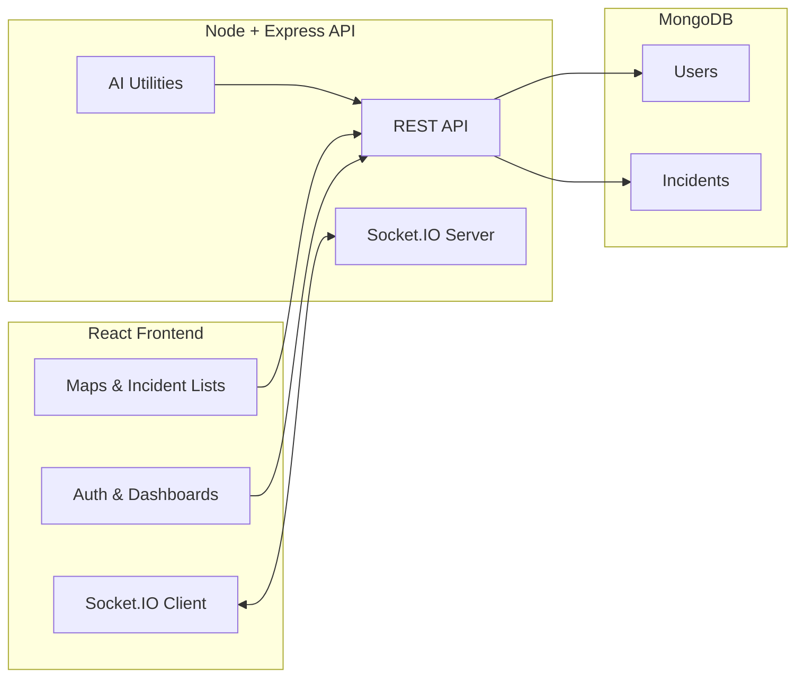
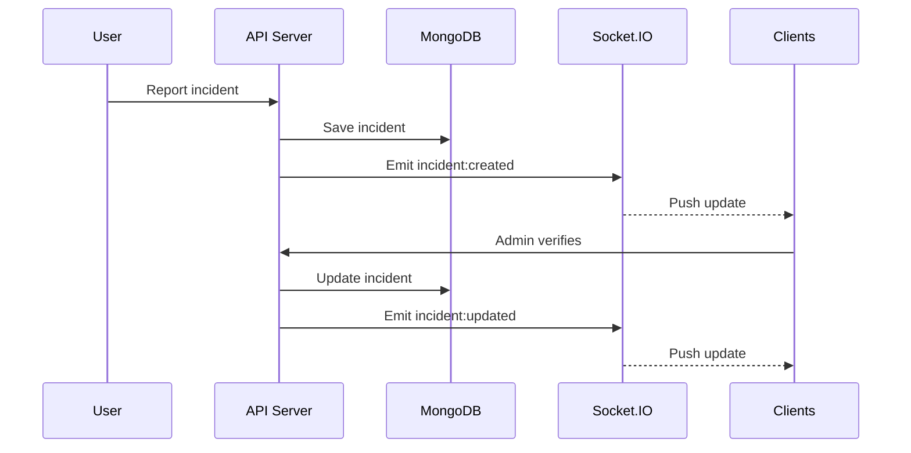
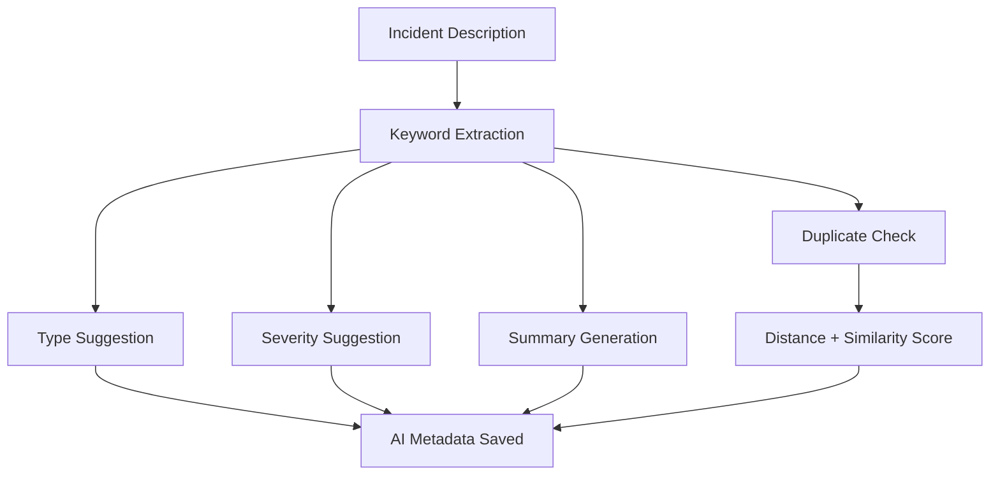
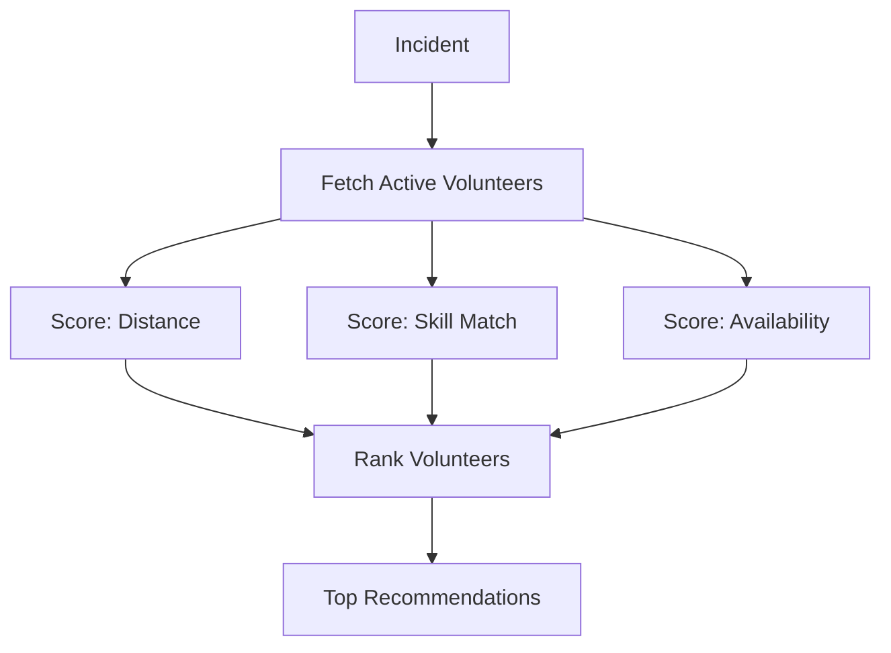

# Implemented Features Summary

This document summarizes the features implemented so far, along with diagrams that describe the current system behavior.

## Implemented Features

### Core Platform
- Role-based access (admin, volunteer, user) with JWT authentication.
- Incident reporting, verification, assignment, and completion flow.
- Map visualization with clustering and optional heatmap layers.
- Volunteer live location updates.

### AI (Free, Offline)
- Rule-based incident classification (type + severity suggestion).
- Auto-summary from incident description.
- Duplicate detection using keyword similarity + proximity.
- Smart dispatch recommendations for admins (distance + skill match + availability).
- All AI runs locally on the server, no paid APIs used.

### Real-time Updates
- Socket.IO integration for live incident updates.
- Events broadcast on incident create/update/delete.
- Volunteer location updates broadcast to clients.
- Dashboards auto-refresh on real-time events.

### UI/UX Improvements
- Modern dark theme across dashboards.
- Consistent typography (Space Grotesk).
- Unified navigation with role-aware menus.
- Enhanced cards, map panels, and lists for incident views.
- Improved visual hierarchy and readable contrast.

## Diagrams

### System Architecture

### Incident Lifecycle (Real-time)

### AI Pipeline (Free, Local)

### Smart Dispatch (Admin)

## Key Files Updated or Added
- Backend
  - utils/incidentAI.js
  - utils/incidentDispatch.js
  - routes/incidents.js
  - routes/admin.js
  - routes/volunteers.js
  - models/Incident.js
  - server.js
- Frontend
  - utils/socket.js
  - components/Dashboard.js
  - components/Admin.js
  - components/Incidents.js
  - components/UserDashboard.js
  - components/Volunteers.js
  - components/Navigation.js
  - index.css

## Notes
- AI is free and fully offline (rule-based).
- Real-time updates require Socket.IO; ensure both backend and frontend are running.
